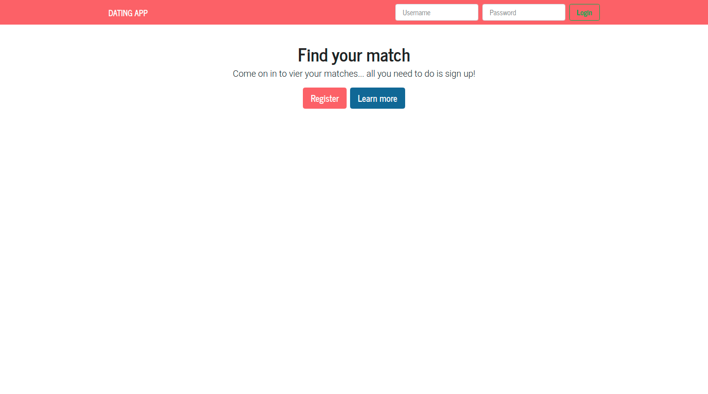

<!-- PROJECT LOGO -->
<br />
<p align="center">

  <h1 align="center">Dating App </h1>

  <p align="center">
    Datting app using to meet new people and chat with them online.
    <br />
    <br />
  </p>
</p>

<!-- TABLE OF CONTENTS -->
## Table of Contents

* [About the Project](#about-the-project)
* [Technologies](#technologies)
* [Features](#features)
* [Setup](#setup)
* [Screenshots](#screenshots)


<!-- ABOUT THE PROJECT -->
## About The Project

It is a web dating app. Main functionalities:
* creating your profile,
* upload your photos,
* add description to your profile,
* scroll other users,
* chat with them live

<!-- TECHNOLOGIES -->
## Technologies
- ASP.NET Core 5 (REST API)
- Angular 12
- Entity Framework Core (MS SQL Server)
- Identity + JWT Authentication
- AutoMapper
- NUnit + Moq (unit testing)
- Bootstrap 5


<!-- Features -->
## Features
- User registration and login
- JWT-based authentication
- Profile management with photo uploads
- Like & messaging system
- Unit tests for backend

<!-- Setup -->
## Setup

```bash
git clone https://github.com/Miatosz/DatingApp.git
```
For Backend 
```bash
cd DatingApp.API
dotnet run
```
For Frontend
```bash
cd DatingApp-SPA
npm install
ng serve
```
Open: http://localhost:4200

## Screenshots



